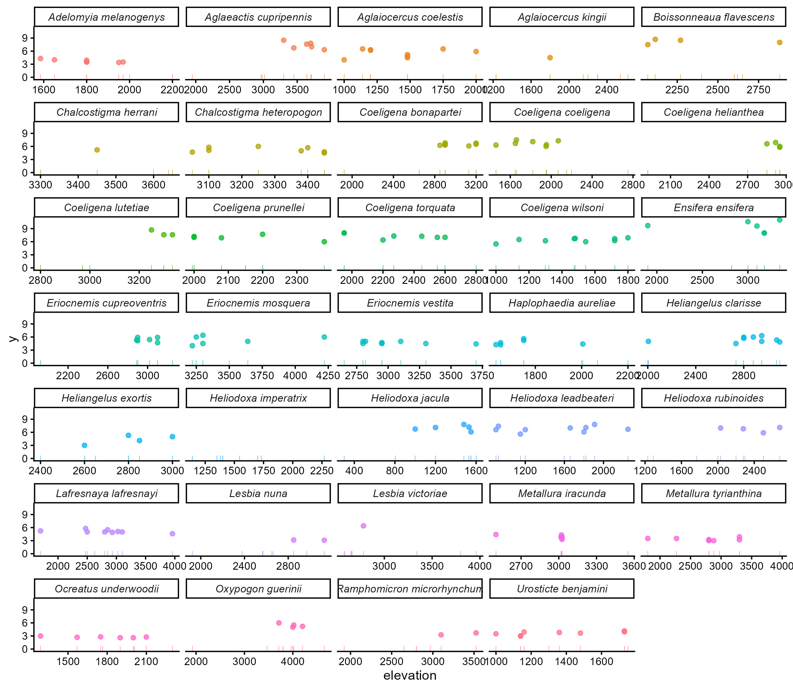
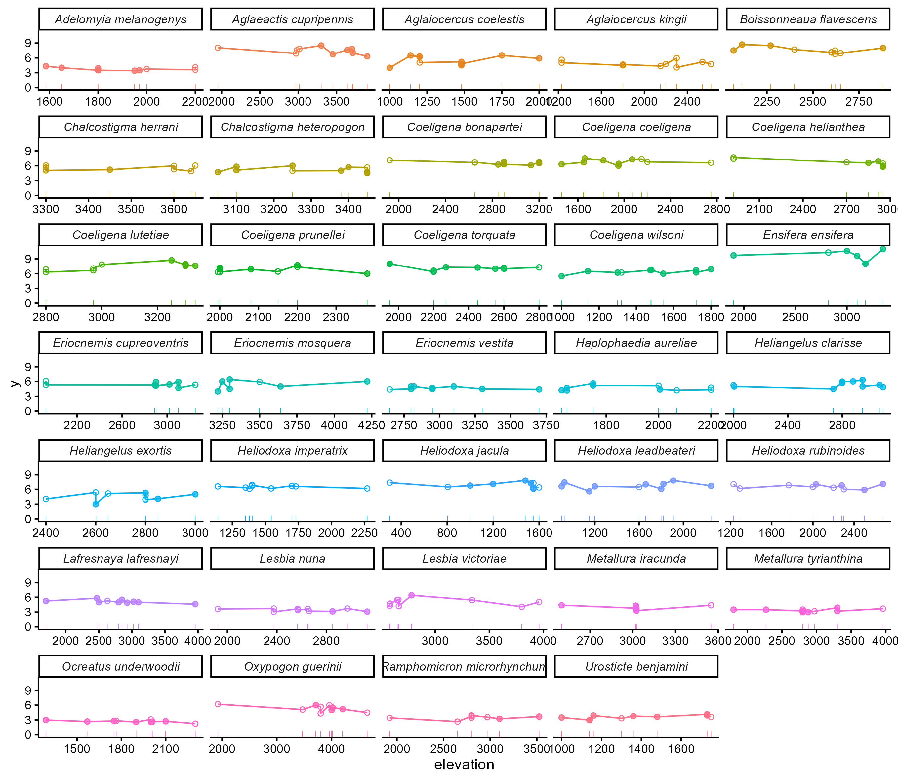

```{r setup, include=FALSE}
knitr::opts_chunk$set(echo = TRUE)
```

# Read me

This paper aims to understand how phenotype variation relates to ecological factors. To do so, we compared morphology and song characteristics of 35 species of Brilliant and Coquette (Andean) hummingbirds to understand how fundamental ecogeographic rules may govern the evolution of morphological and signaling traits.

## Packages

Load the packages used

```{r echo=TRUE, eval=TRUE, warning=FALSE}
library(tidyverse)
library(rjags) # impute
library(dclone) # impute
library(coda) # impute
library(nlme)
library(ggResidpanel)
library(AICcmodavg)
library(emmeans)
library(multcomp)
library(MetBrewer)
library(ape)
library(nlme)
library(phytools)
library(ggtree) #plot pretty phylogenetic trees; see https://bioconductor.org/packages/release/bioc/html/ggtree.html for installation (it takes some time...)

```

# Morphology

The data formatting steps can be skipped, and a final version of the formatted data can be read in at the start of the section "Phylogenetic Generalized Least-Squares (PGLS) in Morphology". 

Here is the code, but it won't run `eval = FALSE`

```{r eval=FALSE}
cladosbc = read_csv('data_raw/morphology.csv') |>
  filter(Especie != "Heliomaster longirostris") |>
  mutate(# eight species changed recently in taxonomy or had double space
         Species = ifelse(Especie == "Heliangelus amethysticolis",
                          "Heliangelus clarisse",
                   ifelse(Especie == "Eriocnemis  cupreoventris",
                          "Eriocnemis cupreoventris",
                   ifelse(Especie == "Heliodoxa  imperatrix",
                          "Heliodoxa imperatrix",
                   ifelse(Especie == "Heliodoxa  jacula",
                          "Heliodoxa jacula",
                   ifelse(Especie == "Heliodoxa  leadbeateri",
                          "Heliodoxa leadbeateri",
                   ifelse(Especie == "Heliodoxa  rubinoides",
                          "Heliodoxa rubinoides",
                   ifelse(Especie == "Ocreatus  underwoodii",
                          "Ocreatus underwoodii",
                    ifelse(Especie == "Aglaiocercus kingi",
                          "Aglaiocercus kingii",
                    Especie)))))))),
         across(.cols = c(1:5, 11:19), factor), 
         Cola = as.numeric(Cola),
         Clado = case_when(Clado == "Brillantes" ~ "brilliants",
                           Clado == "Coquetas" ~ "coquettes"),
         Sexo = case_when(Sexo == "M" ~ "male",
                             Sexo == "H" ~ "female"),
         Habitat = case_when(Habitat == "Bosque" ~ "forest",
                             Habitat == "Matorral" ~ "shrubland",
                             Habitat == "Pastizal" ~ "grassland")) |>
  rename(Numero.catalogo = 1, 
         Tipo.flor = `Tipo flor`,
         tail = Cola,
         wing = Ala,
         beak = Pico,
         sex = Sexo,
         elevation = Elevación) |> 
  filter(Numero.catalogo != '22164')

cladosbc[84,6] <- 2800 #An error in row 84 regarding elevation was modified.

cladosbc = cladosbc |> 
  mutate(elevationScaled = scale(elevation))
```

This is not a problem because the data is already loaded
```{r eval = TRUE}
load("data_raw/Andean.RData")

summary(cladosbc)
```

## Impute missing values under a Bayesian framework

We assume that the data missing is at random because the probability to collect an individual does not depend on its tail or body mass measurements $T_i$ ([Kery & Royle, 2016](https://www-mbr--pwrc-usgs-gov.translate.goog/pubanalysis/keryroylebook/?_x_tr_sl=en&_x_tr_tl=es&_x_tr_hl=es&_x_tr_pto=tc)). Therefore, we model as latent variable the tail and body mass measurements in JAGS, using as predictors the species, elevation, sex, and the other measurements to control for allometric relationship.

$$
\text{T}_{i} \sim \text{Normal}(\mu_{i},\sigma^{2}) \\
\mu_{i} = \beta_{0} + \beta_{1} \times elev_{i} + \beta_{2}  \times (species_{i} \times sex_{i}) + \beta_3  \times wing_i + \beta_4  \times beak_i
$$
where $T$ is the measurement of the trait (tail or body mass).

The model in JAGS language is:
```{r eval = FALSE}
Impute.model <- function(){
  # Likelihood
  for (i in 1:N) {
    # Tail model
    tail[i] ~ dnorm(mu_tail[i], tau_tail)
    mu_tail[i] <- beta0_tail + 
                  beta1_tail * elev[i] + 
                  beta2_tail[interaction_index[i]] + 
                  beta3_tail * wing[i] + 
                  beta4_tail * beak[i]
    # Body mass model
    bodymass[i] ~ dnorm(mu_body[i], tau_body)
    mu_body[i] <- beta0_body + 
                  beta1_body * elev[i] + 
                  beta2_body[interaction_index[i]] + 
                  beta3_body * wing[i] + 
                  beta4_body * beak[i]
  }
  
  # Priors for tail
  beta0_tail ~ dnorm(0, 0.001)
  beta1_tail ~ dnorm(0, 0.001)
  for (k in 1:(n_species * n_sex)) {
    beta2_tail[k] ~ dnorm(0, tau_interaction_tail)
  }
  tau_interaction_tail ~ dgamma(0.001, 0.001)
  beta3_tail ~ dnorm(0, 0.001)
  beta4_tail ~ dnorm(0, 0.001)
  tau_tail ~ dgamma(0.001, 0.001)
  
  # Priors for bodymass
  beta0_body ~ dnorm(0, 0.001)
  beta1_body ~ dnorm(0, 0.001)
  for (k in 1:(n_species * n_sex)) {
    beta2_body[k] ~ dnorm(0, tau_interaction_body)
  }
  tau_interaction_body ~ dgamma(0.001, 0.001)
  beta3_body ~ dnorm(0, 0.001)
  beta4_body ~ dnorm(0, 0.001)
  tau_body ~ dgamma(0.001, 0.001)
}

```

We need to adjust the data for this model.

```{r eval = FALSE}
n_species <- length(unique(cladosbc$Species))
n_sex <- length(unique(cladosbc$sex))

data_jags <- cladosbc |> 
  dplyr::mutate(
    species = as.numeric(as.factor(Species)),
    sex = as.numeric(as.factor(sex)),
    interaction_index = (species - 1) * n_sex + sex
  )

dat <- list(
  N = nrow(data_jags),
  tail = data_jags$tail,
  bodymass = data_jags$bodymass,
  wing = data_jags$wing,
  beak = data_jags$beak,
  elev = data_jags$elevation,
  interaction_index = data_jags$interaction_index,
  n_species = n_species,
  n_sex = n_sex
)

```

Fit the model

```{r eval = FALSE}
Impute.fit <- jags.fit(data = dat,
                       params = c("tail","bodymass"),
                       model = Impute.model)
```

Extract posterior means and add to original data to see the missing values

```{r eval = FALSE}

# Convert to matrix
mcmc_mat <- as.matrix(Impute.fit)

# Extract posterior means
tail_means <- colMeans(mcmc_mat[, grep("^tail\\[", colnames(mcmc_mat))])
bodymass_means <- colMeans(mcmc_mat[, grep("^bodymass\\[", colnames(mcmc_mat))])

# Add new columns with imputed values
cladosbc$tail_imputed <- cladosbc$tail
cladosbc$tail_imputed[is.na(cladosbc$tail)] <- tail_means[is.na(cladosbc$tail)]

cladosbc$bodymass_imputed <- cladosbc$bodymass
cladosbc$bodymass_imputed[is.na(cladosbc$bodymass)] <- bodymass_means[is.na(cladosbc$bodymass)]

saveRDS(cladosbc, 'data_raw/cladosbc.rda')
```

### How this imputation looks like?

Body mass for the different species pre-imputation:
```{r eval = FALSE}
body_mass_pre <-cladosbc |>
  ggplot(aes(x = elevation, y = bodymass, color = Species))+
  geom_point(aes(y = 0), shape = "|")+
  geom_point(alpha = 0.75) +
  facet_wrap(~Species, scales = "free_x", ncol = 5) +
  theme_classic() +
  theme(legend.position = "none", 
        strip.text = element_text(face = "italic"))
ggsave(filename = "figures/bm_pre_impute.jpg", body_mass_pre, dpi = 300,
       width = 230, height = 200, units = "mm")
```


Body mass for the different species post-imputation:

```{r eval = FALSE}
body_mass_post <-cladosbc |>
  ggplot(aes(x = elevation, y = bodymass, color = Species))+
  geom_point(aes(y = 0), shape = "|")+
  geom_line(aes(y = bodymass_imputed))+
  geom_point(aes(y = bodymass_imputed), shape = 21)+
  geom_point(alpha = 0.75) +
  facet_wrap(~Species, scales = "free_x", ncol = 5) +
  theme_classic() +
  theme(legend.position = "none", 
        strip.text = element_text(face = "italic"))
ggsave(filename = "figures/bm_post_impute.jpg", body_mass_post, dpi = 300,
       width = 230, height = 200, units = "mm")
```


## Phylogenetic signal

Load the phylogenetic tree

```{r eval = FALSE}
tree <- read.nexus("data_raw/summary_dated_clements.nex")
```

Adjust name as in the phylogeny, and reorder the data
```{r eval = FALSE}
cladosbc$Spp_phylo <- gsub(" ", "_", cladosbc$Species)

cladosbc <- cladosbc |>
  relocate(c(Species, Spp_phylo), .before = Clado) |>
  relocate(c(Species, Spp_phylo, Clado), .before = Numero.catalogo)
```

Select the species and prune the the tree
```{r eval = FALSE}
species <- unique(cladosbc$Spp_phylo)

tree_spp <- drop.tip(tree, setdiff(tree$tip.label, species))
tree_spp
plot(tree_spp, cex = 0.6)
```

Now we need to homogenize the tree tip labels with our species names. We replace "_" between names with a space.

```{r eval = FALSE}
tree_spp$tip.label = gsub(tree_spp$tip.label, 
                                  pattern = "_", replacement = " ")
```

Here, we compute the correlation matrix using `ape`.
```{r eval = FALSE}
# Create correlation matrix for analysis
phylo_tree_cor = ape::vcv(tree_spp, cor = T)
saveRDS(phylo_tree_cor, 'data_raw/phylo_tree_cor.rda')
```

Finally, we will plot the tree using blue for coquettes and orange for brilliants
```{r plotting tree, eval = FALSE}
met.brewer("Renoir", n = 2)
taxa_palette = c('coquettes'=as.vector(met.brewer("Renoir", n = 2))[2], 
                 'brilliants'= as.vector(met.brewer("Renoir", n = 2))[1])

a = ggtree(tree_spp) %<+% cladosbc + 
  geom_tiplab(aes(color = Clado), #label = ott_species), 
              align = TRUE, size = 4.3, offset = 0.0, fontface = 3) + 
                # , align = TRUE, size = 3, offset = 0.1)
  scale_color_manual(values = taxa_palette) +
  theme_tree()+
  theme(axis.text = element_text(size = 12),
        legend.position = "none", #c(0.48,0.89)
        legend.text = element_text(size = 14),
        legend.title = element_text(size = 14),
        legend.background = element_blank(),
        plot.margin =margin(0, 0, 0,-5, unit = "cm")) +
  scale_y_continuous(expand=c(0, 1)) +
  scale_x_continuous(expand=c(1, 0.5))
```


```{r}
a
```

## Phylogenetic Generalized Least-Squares (PGLS) in Morphology

Import previously formatted data:

```{r}
cladosbc = readRDS('data_raw/cladosbc.rda')
phylo_tree_cor = readRDS('data_raw/phylo_tree_cor.rda')
```

Lets try the longer format suggested by Simon, adjusting the correlation for phylogenetic relationship

```{r eval = FALSE}
cladosbc_long = cladosbc |> 
  mutate(bm_imp = bodymass_imputed*10) |> # putting in a similar scale
  pivot_longer(cols = c('tail_imputed', 'beak', 'wing', 'bm_imp'), 
               names_to = 'trait', values_to = 'value')

cladosbc_long$trait <- as.factor(cladosbc_long$trait)

```

Define the formula for the models

```{r}
resp_var = 'value'  # define response variable

# Create a list containing one-sided formulas for all the candidate models
form_list = list(
  ~ trait/1,                             #mod1 - "null"
  ~ trait/elevationScaled,               #mod2 - Elevation (num)
  ~ trait/Clado,                         #mod3 - Clade (brilliants vs coquettes)
  ~ trait/sex,                           #mod4 - Sex (female vs male)
  ~ trait/Habitat,                       #mod5 - Habitat (grassland vs shrubland vs forest)
  ~ trait/elevationScaled + Clado,       #mod6
  ~ trait/elevationScaled + sex,         #mod7
  ~ trait/elevationScaled + Habitat,     #mod8
  ~ trait/elevationScaled*Clado,         #mod9
  ~ trait/elevationScaled*sex,           #mod10
  ~ trait/elevationScaled*Habitat        #mod11
)
```

To include the phylogenetic correlations, we are going to test three evolutionary models in this section: 

### Pagel's lambda optimization 

If $\lambda = 1$, there is phylogenetic signal under Brownian motion or "random walk", where the amount of evolutionary change is proportional to the time elapsed. On the other hand, if $\lambda = 0$, the covariance between all species become zero, removing any phylogenetic signal from the traits (species traits evolve independent). Values in between may indicate in between phylogenetic signal, not purely independent but not purely Brownian; closely related species may more similar than expected by chance, but less similar than a pure Brownian motion model would predict.

```{r eval=FALSE}
mod_list_lambda = list() # Empty list to save results

# Now iterate through each formula in the form_list...
for (n in 1:length(form_list)){
  # ... paste in the name of the response variable...
  formula_n = formula(paste(resp_var, form_list[n])) 
  #...fit the model, and save it in the mod_list...
  mod_list_lambda[[n]] = gls(formula_n, data = cladosbc_long, 
                      correlation = corPagel(1, phy = tree_spp, 
                                            form = ~ Species|trait), 
                      method = 'ML',
                      na.action = na.omit)
  #...and print out which iteration was just completed
  print(paste('model number: ', n, ' - fit - ', formula_n))
}

names(mod_list_lambda) = form_list
```

Refitting the same models, but with modified formula for the Pagel correlation structure, in which phylogenetic correlation applies within traits but not between them:

```{r eval=FALSE}
mod_list_lambda_2 = list() # Empty list to save results

# Now iterate through each formula in the form_list...
for (n in 1:length(form_list)){
  # ... paste in the name of the response variable...
  formula_n = formula(paste(resp_var, form_list[n])) 
  #...fit the model, and save it in the mod_list...
  mod_list_lambda_2[[n]] = gls(formula_n, data = cladosbc_long, 
                      correlation = corPagel(1, phy = tree_spp, 
                                            form = ~ Species|trait), 
                      method = 'ML',
                      na.action = na.omit)
  #...and print out which iteration was just completed
  print(paste('model number: ', n, ' - fit - ', formula_n))
}

names(mod_list_lambda_2) = form_list
```

Check the fitted models (assembled into a list). Note the better fit of all models with phylogenetic correlations within, but not across, traits:

```{r}
# Now the fitted models (already assembled into a list) can be compared with AICc
aictab(mod_list_lambda) #  ~ trait/elevationScaled*Clado        #mod9
aictab(mod_list_lambda_2) #  ~ trait/elevationScaled*sex        #mod10
```

### Ornstein-Uhlenbeck (OU)

Models evolution toward an optimal value, useful when selection is suspected.

```{r eval=FALSE}
mod_list_OU = list() # Empty list to save results

# Now iterate through each formula in the form_list...
for (n in 1:length(form_list)){
  # ... paste in the name of the response variable...
  formula_n = formula(paste(resp_var, form_list[n])) 
  #...fit the model, and save it in the mod_list...
  mod_list_OU[[n]] = gls(formula_n, data = cladosbc_long, 
                      correlation = corMartins(1, phy = tree_spp, 
                                            form = ~ Species|trait), 
                      method = 'ML',
                      na.action = na.omit)
  #...and print out which iteration was just completed
  print(paste(resp_var, 'model number', n, 'fit'))
}
names(mod_list_OU) = form_list
```

Refitting the same models, but with modified formula for the correlation structure, in which phylogenetic correlation applies within traits but not between them. Note that due to non-convergence for some models, we need an error handler so that the loop isn't interupted. 

```{r}
# Define function for checking/handling errors:
tryCatch.W.E = function(expr){
    W <- NULL
    w.handler <- function(w) { # warning handler
	W <<- w
	invokeRestart("muffleWarning")
    }
    list(value = withCallingHandlers(tryCatch(expr, error = function(e) e),
				     warning = w.handler),
	 warning = W)
}
```


```{r eval=FALSE}
mod_list_OU_2 = list() # Empty list to save results

# Now iterate through each formula in the form_list...
for (n in 1:length(form_list)){
  # ... paste in the name of the response variable...
  formula_n = formula(paste(resp_var, form_list[n])) 
  #...fit the model, and save it in the mod_list...
  mod_list_OU_2[[n]] = tryCatch.W.E({gls(formula_n, data = cladosbc_long, 
                      correlation = corMartins(1, phy = tree_spp, 
                                            form = ~ Species|trait), 
                      method = 'ML',
                      na.action = na.omit)})
  #...and print out which iteration was just completed
  print(paste(resp_var, 'model number', n, 'fit'))
}
names(mod_list_OU_2) = form_list

mod_list_OU_2 = sapply(mod_list_OU_2, \(x){x$value})
mod_list_OU_2 = mod_list_OU_2[sapply(mod_list_OU_2, \(x) {!('error' %in% class(x))})]
```

Check the fitted models (assembled into a list)

```{r}
# Now the fitted models (already assembled into a list) can be compared with AICc
aictab(mod_list_OU)   #  ~ trait/elevationScaled*Clado        # again mod9!!
aictab(mod_list_OU_2) # 
```

**Simon left off here: None of the results/conclusions presented or discussed below has been reviewed or revised since the introduction of the alternative models**

### Results of morphology PGLS

Lambda ($\hat{\lambda} = 0.089$; Close to 0, NO Brownian - random walk - phylogenetic signal), while OU ($\hat{\alpha}=1.618$; Strong stabilizing selection towards an optimum trait value). In both evolutionary models, they selected the model 9.

$$
Value_{Trait} \sim \frac{Trait}{Elevation*Clade}
$$

```{r}
pgls_lambda <- mod_list_lambda$`~trait/elevationScaled * sex`
pgls_OU <- mod_list_OU[[9]]

# add model prediction
cladosbc_long$p_pgls_lambda = predict(pgls_lambda, cladosbc_long)
cladosbc_long$p_pgls_OU = predict(pgls_OU, cladosbc_long)

# calculating pseudo R² 
pseudo_r2_lambda <- cor(cladosbc_long$value, cladosbc_long$p_pgls_lambda)^2; 
pseudo_r2_lambda

pseudo_r2_OU <- cor(cladosbc_long$value, cladosbc_long$p_pgls_OU)^2; 
pseudo_r2_OU

```

We can plot both models

```{r eval = FALSE}
# need scaling and centering factors
cnt = attr(scale(cladosbc$elevation), 'scaled:center')
scl = attr(scale(cladosbc$elevation), 'scaled:scale')
# And the range of the scaled values
rng = range(cladosbc$elevationScaled)
```

Lambda
```{r}
# Generate predictions with emmeans (the Estimated Marginal Means!!)
lambda_emm = emmeans(pgls_lambda, ~ trait:elevationScaled:sex, 
                 at = list(elevationScaled = seq(rng[1], rng[2], .1)), 
                 mode = 'df.error') |> 
  as.data.frame() |> 
  mutate(elevation = scl*elevationScaled + cnt)

lambda_emm |>
  group_by(trait, sex) |>
  summarise(L.lower.CL = min(lower.CL),
            emmeanMin = min(emmean),
            U.lower.CL = max(lower.CL),
            L.upper.CL = min(upper.CL),
            emmeanMax = max(emmean),
            U.upper.CL = max(upper.CL))


# Plot results
lambda_emm |> 
  mutate(trait = case_when(trait == "beak" ~ "Beak length (mm)",
                           trait == "bm_imp" ~ "Body mass (gr x 10)",
                           trait == "tail_imputed" ~ "Tail length (mm)",
                           trait == "wing" ~ "Wing length (mm)")) |>
  ggplot(aes(x = elevation, color = sex, fill = sex))+
  facet_wrap(~ trait, nrow = 1, scales = 'free') +
  geom_ribbon(aes(ymin = lower.CL, ymax = upper.CL), color = NA, alpha = .2) +
  geom_line(aes(y = emmean))+
  geom_point(data = cladosbc_long |> 
               mutate(trait = case_when(trait == "beak" ~ "Beak length (mm)",
                                        trait == "bm_imp" ~ "Body mass (gr x 10)",
                                        trait == "tail_imputed" ~ "Tail length (mm)",
                                        trait == "wing" ~ "Wing length (mm)")), 
             aes(y = value), 
             alpha = 0.25) +
  scale_color_met_d("Renoir")+
  scale_fill_met_d("Renoir")+
  labs(x = "Elevation (m)",
       y = "Value (mm or gr*10)",
       color = "Sex",
       fill = "Sex",
       title = "PGLS - Lambda") +
  theme_classic() +
  theme(legend.position = "bottom", 
        axis.text.x = element_text(angle = 45, hjust = 1)) 
```

OU
```{r}
# Generate predictions with emmeans (the Estimated Marginal Means!!)
OU_emm = emmeans(pgls_OU, ~ trait:elevationScaled:Clado, 
                 at = list(elevationScaled = seq(rng[1], rng[2], .1)), 
                 mode = 'df.error') |> 
  as.data.frame() |> 
  mutate(elevation = scl*elevationScaled + cnt)

OU_emm |>
  group_by(trait, Clado) |>
  summarise(L.lower.CL = min(lower.CL),
            emmeanMin = min(emmean),
            U.lower.CL = max(lower.CL),
            L.upper.CL = min(upper.CL),
            emmeanMax = max(emmean),
            U.upper.CL = max(upper.CL))

# Plot results
OU_emm |> 
  mutate(trait = case_when(trait == "beak" ~ "Beak length (mm)",
                           trait == "bm_imp" ~ "Body mass (gr x 10)",
                           trait == "tail_imputed" ~ "Tail length (mm)",
                           trait == "wing" ~ "Wing length (mm)")) |>
  ggplot(aes(x = elevation, color = Clado, fill = Clado))+
  facet_wrap(~ trait, nrow = 1, scales = 'free') +
  geom_ribbon(aes(ymin = lower.CL, ymax = upper.CL), color = NA, alpha = .2) +
  geom_line(aes(y = emmean))+
  geom_point(data = cladosbc_long |> 
  mutate(trait = case_when(trait == "beak" ~ "Beak length (mm)",
                           trait == "bm_imp" ~ "Body mass (gr x 10)",
                           trait == "tail_imputed" ~ "Tail length (mm)",
                           trait == "wing" ~ "Wing length (mm)")), 
             aes(y = value), 
             alpha = 0.25) +
  scale_color_met_d("Renoir")+
  scale_fill_met_d("Renoir")+
  labs(x = "Elevation (m)",
       y = "Value measurement",
       color = "Clade",
       fill = "Clade",
       title = "PGLS - Ornstein-Uhlenbeck (OU)") +
  theme_classic() +
  theme(legend.position = "bottom", 
        axis.text.x = element_text(angle = 45, hjust = 1)) 

```
