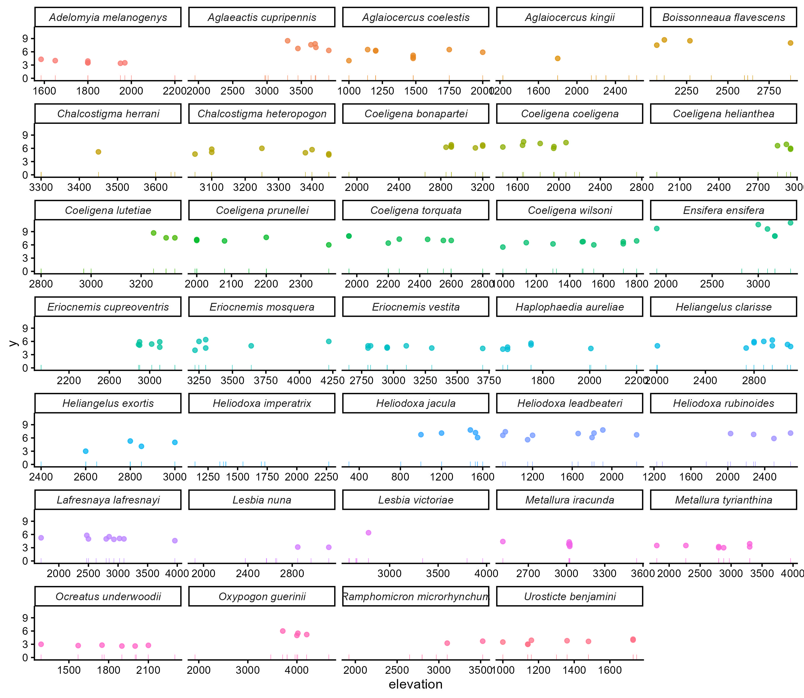
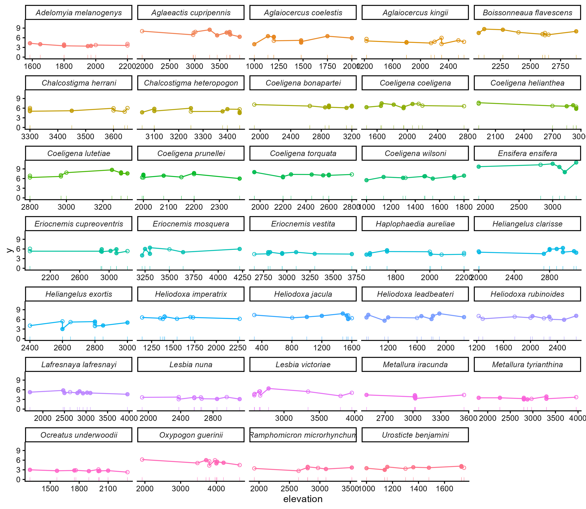

```{r setup, include=FALSE}
knitr::opts_chunk$set(echo = TRUE)
```

# Read me

This paper aims to understand how phenotype variation relates to ecological factors. To do so, we compared morphology and song characteristics of 35 species of Brilliant and Coquette (Andean) hummingbirds to understand how fundamental ecogeographic rules may govern the evolution of morphological and signaling traits.

## Packages

Load the packages used

```{r echo=TRUE, eval=TRUE, warning=FALSE}
library(tidyverse)
library(rjags) # impute
library(dclone) # impute
library(coda) # impute
library(nlme)
library(ggResidpanel)
library(AICcmodavg)
library(emmeans)
library(multcomp)
library(MetBrewer)
library(ape)
library(nlme)
library(phytools)
library(ggtree) #plot pretty phylogenetic trees; see https://bioconductor.org/packages/release/bioc/html/ggtree.html for installation (it takes some time...)

```

# Morphology

The data formatting steps can be skipped, and a final version of the formatted data can be read in at the start of the section "Phylogenetic Generalized Least-Squares (PGLS) in Morphology". 

Here is the code, but it won't run `eval = FALSE`

```{r eval=TRUE}
cladosbc = read_csv('data_raw/morphology.csv') |>
  filter(Especie != "Heliomaster longirostris") |>
  mutate(# eight species changed recently in taxonomy or had double space
         Species = ifelse(Especie == "Heliangelus amethysticolis",
                          "Heliangelus clarisse",
                   ifelse(Especie == "Eriocnemis  cupreoventris",
                          "Eriocnemis cupreoventris",
                   ifelse(Especie == "Heliodoxa  imperatrix",
                          "Heliodoxa imperatrix",
                   ifelse(Especie == "Heliodoxa  jacula",
                          "Heliodoxa jacula",
                   ifelse(Especie == "Heliodoxa  leadbeateri",
                          "Heliodoxa leadbeateri",
                   ifelse(Especie == "Heliodoxa  rubinoides",
                          "Heliodoxa rubinoides",
                   ifelse(Especie == "Ocreatus  underwoodii",
                          "Ocreatus underwoodii",
                    ifelse(Especie == "Aglaiocercus kingi",
                          "Aglaiocercus kingii",
                    Especie)))))))),
         across(.cols = c(1:5, 11:19), factor), 
         Cola = as.numeric(Cola),
         Clado = case_when(Clado == "Brillantes" ~ "brilliants",
                           Clado == "Coquetas" ~ "coquettes"),
         Sexo = case_when(Sexo == "M" ~ "male",
                             Sexo == "H" ~ "female"),
         Habitat = case_when(Habitat == "Bosque" ~ "forest",
                             Habitat == "Matorral" ~ "shrubland",
                             Habitat == "Pastizal" ~ "grassland")) |>
  rename(Numero.catalogo = 1, 
         Tipo.flor = `Tipo flor`,
         tail = Cola,
         wing = Ala,
         beak = Pico,
         sex = Sexo,
         elevation = Elevación) |> 
  filter(Numero.catalogo != '22164')

cladosbc[84,6] <- 2800 #An error in row 84 regarding elevation was modified.

cladosbc = cladosbc |> 
  mutate(elevationScaled = scale(elevation))
```

## Impute missing values under a Bayesian framework

We assume that the data missing is at random because the probability to collect an individual does not depend on its tail or body mass measurements $T_i$ ([Kery & Royle, 2016](https://www-mbr--pwrc-usgs-gov.translate.goog/pubanalysis/keryroylebook/?_x_tr_sl=en&_x_tr_tl=es&_x_tr_hl=es&_x_tr_pto=tc)). Therefore, we model as latent variable the tail and body mass measurements in JAGS, using as predictors the species, elevation, sex, and the other measurements to control for allometric relationship.

$$
\text{T}_{i} \sim \text{Normal}(\mu_{i},\sigma^{2}) \\
\mu_{i} = \beta_{0} + \beta_{1} \times elev_{i} + \beta_{2}  \times (species_{i} \times sex_{i}) + \beta_3  \times wing_i + \beta_4  \times beak_i
$$
where $T$ is the measurement of the trait (tail or body mass).

The model in JAGS language is:
```{r eval = TRUE}
Impute.model <- function(){
  # Likelihood
  for (i in 1:N) {
    # Tail model
    tail[i] ~ dnorm(mu_tail[i], tau_tail)
    mu_tail[i] <- beta0_tail + 
                  beta1_tail * elev[i] + 
                  beta2_tail[interaction_index[i]] + 
                  beta3_tail * wing[i] + 
                  beta4_tail * beak[i]
    # Body mass model
    bodymass[i] ~ dnorm(mu_body[i], tau_body)
    mu_body[i] <- beta0_body + 
                  beta1_body * elev[i] + 
                  beta2_body[interaction_index[i]] + 
                  beta3_body * wing[i] + 
                  beta4_body * beak[i]
  
  # for posterior predictive check
  tail_rep[i] ~ dnorm(mu_tail[i], tau_tail)
  bodymass_rep[i] ~ dnorm(mu_body[i], tau_body)
  }
 
  
  # Priors for tail
  beta0_tail ~ dnorm(0, 0.001)
  beta1_tail ~ dnorm(0, 0.001)
  for (k in 1:(n_species * n_sex)) {
    beta2_tail[k] ~ dnorm(0, tau_interaction_tail)
  }
  tau_interaction_tail ~ dgamma(0.001, 0.001)
  beta3_tail ~ dnorm(0, 0.001)
  beta4_tail ~ dnorm(0, 0.001)
  tau_tail ~ dgamma(0.001, 0.001)
  
  # Priors for bodymass
  beta0_body ~ dnorm(0, 0.001)
  beta1_body ~ dnorm(0, 0.001)
  for (k in 1:(n_species * n_sex)) {
    beta2_body[k] ~ dnorm(0, tau_interaction_body)
  }
  tau_interaction_body ~ dgamma(0.001, 0.001)
  beta3_body ~ dnorm(0, 0.001)
  beta4_body ~ dnorm(0, 0.001)
  tau_body ~ dgamma(0.001, 0.001)
}

```

We need to adjust the data for this model.

```{r eval = TRUE}
n_species <- length(unique(cladosbc$Species))
n_sex <- length(unique(cladosbc$sex))

data_jags <- cladosbc |> 
  dplyr::mutate(
    species = as.numeric(as.factor(Species)),
    sex = as.numeric(as.factor(sex)),
    interaction_index = (species - 1) * n_sex + sex
  )

dat <- list(
  N = nrow(data_jags),
  tail = data_jags$tail,
  bodymass = data_jags$bodymass,
  wing = data_jags$wing,
  beak = data_jags$beak,
  elev = data_jags$elevation,
  interaction_index = data_jags$interaction_index,
  n_species = n_species,
  n_sex = n_sex
)

```

Fit the model

```{r eval = TRUE}
Impute.fit <- jags.fit(data = dat,
                       params = c("tail","bodymass", 
                                  'tail_rep', 'bodymass_rep'),
                       model = Impute.model, 
                       n.chains = 4, thin = 5, n.iter = 10000)
```

Extract posterior means and add to original data to see the missing values

```{r eval = TRUE}
# Convert to matrix
mcmc_mat <- as.matrix(Impute.fit)

# Extract posterior means
tail_means <- colMeans(mcmc_mat[, grep("^tail\\[", colnames(mcmc_mat))])
bodymass_means <- colMeans(mcmc_mat[, grep("^bodymass\\[", colnames(mcmc_mat))])
```

The model looks reasonable, but we should check carefully before proceeding with the imputed values. We can use a posterior predictive check to see if the posterior distribution reasonably matches the observed values (shown in orange). We can see that the model for the bodymass appears quite good. The model for tail length is failing pretty badly in a small number of cases, but it is also true only 4 tail values need imputing, so it's not too worrying.  

```{r}
post <- apply(mcmc_mat, 2, quantile, c(0.5, 0.005, 0.10, 0.9, 0.995))
tail_post = post[, grep("tail_rep", colnames(post))] |> 
  t() |> 
  as.data.frame() |> 
  mutate(Obs = row_number(), .before = `50%`) 

ggplot(tail_post, aes(x = Obs)) + 
  geom_errorbar(aes(ymin = `0.5%`, ymax = `99.5%`), linewidth = 2, 
                color = 'grey80')+
  geom_errorbar(aes(ymin = `10%`, ymax = `90%`), linewidth = 2, 
                color = 'grey40') +
  geom_point(aes(y = `50%`), 
             fill = 'blue', 
             shape = 24)+
  geom_point(data = mutate(cladosbc, Obs = row_number()), 
             aes(y = tail), 
             fill = 'orange', 
             shape = 21)+
  theme_classic()
```

```{r}
bodymass_post = post[, grep("bodymass_rep", colnames(post))] |> 
  t() |> 
  as.data.frame() |> 
  mutate(Obs = row_number(), .before = `50%`)

ggplot(bodymass_post, aes(x = Obs)) + 
  geom_errorbar(aes(ymin = `0.5%`, ymax = `99.5%`), linewidth = 2, 
                color = 'grey80')+
  geom_errorbar(aes(ymin = `10%`, ymax = `90%`), linewidth = 2, 
                color = 'grey40') +
  geom_point(aes(y = `50%`), 
             fill = 'blue',
             shape = 24)+
  geom_point(data = mutate(cladosbc, Obs = row_number()),
             aes(y = bodymass), 
             fill = 'orange',
             shape = 21) +
  theme_classic()
```


```{r}
# Add new columns with imputed values
cladosbc$tail_imputed <- cladosbc$tail
cladosbc$tail_imputed[is.na(cladosbc$tail)] <- tail_means[is.na(cladosbc$tail)]

cladosbc$bodymass_imputed <- cladosbc$bodymass
cladosbc$bodymass_imputed[is.na(cladosbc$bodymass)] <- bodymass_means[is.na(cladosbc$bodymass)]

saveRDS(cladosbc, 'data_raw/cladosbc.rda')
```

### How this imputation looks like?

Body mass for the different species pre-imputation:

```{r eval = FALSE}
body_mass_pre <-cladosbc |>
  ggplot(aes(x = elevation, y = bodymass, color = Species))+
  geom_point(aes(y = 0), shape = "|")+
  geom_point(alpha = 0.75) +
  facet_wrap(~Species, scales = "free_x", ncol = 5) +
  theme_classic() +
  theme(legend.position = "none", 
        strip.text = element_text(face = "italic"))

ggsave(filename = "figures/bm_pre_impute.jpg", body_mass_pre, dpi = 300,
       width = 230, height = 200, units = "mm")
```


Body mass for the different species post-imputation:

```{r eval = FALSE}
body_mass_post <-cladosbc |>
  ggplot(aes(x = elevation, y = bodymass, color = Species))+
  geom_point(aes(y = 0), shape = "|")+
  geom_line(aes(y = bodymass_imputed))+
  geom_point(aes(y = bodymass_imputed), shape = 21)+
  geom_point(alpha = 0.75) +
  facet_wrap(~Species, scales = "free_x", ncol = 5) +
  theme_classic() +
  theme(legend.position = "none", 
        strip.text = element_text(face = "italic"))
ggsave(filename = "figures/bm_post_impute.jpg", body_mass_post, dpi = 300,
       width = 230, height = 200, units = "mm")
```


## Phylogenetic signal

Load the phylogenetic tree

```{r eval = FALSE}
tree <- read.nexus("data_raw/summary_dated_clements.nex")
```

Adjust name as in the phylogeny, and reorder the data
```{r eval = FALSE}
cladosbc$Spp_phylo <- gsub(" ", "_", cladosbc$Species)

cladosbc <- cladosbc |>
  relocate(c(Species, Spp_phylo), .before = Clado) |>
  relocate(c(Species, Spp_phylo, Clado), .before = Numero.catalogo)
```

Select the species and prune the the tree
```{r eval = FALSE}
species <- unique(cladosbc$Spp_phylo)

tree_spp <- drop.tip(tree, setdiff(tree$tip.label, species))
tree_spp
plot(tree_spp, cex = 0.6)
```

Now we need to homogenize the tree tip labels with our species names. We replace "_" between names with a space.

```{r eval = TRUE}
tree_spp$tip.label = gsub(tree_spp$tip.label, 
                                  pattern = "_", replacement = " ")
```

Here, we compute the correlation matrix using `ape`.
```{r eval = TRUE}
# Create correlation matrix for analysis
phylo_tree_cor = ape::vcv(tree_spp, cor = T)
saveRDS(phylo_tree_cor, 'data_raw/phylo_tree_cor.rda')
```

Finally, we will plot the tree using blue for coquettes and orange for brilliants
```{r plotting tree, eval = FALSE}
met.brewer("Renoir", n = 2)
taxa_palette = c('coquettes'=as.vector(met.brewer("Renoir", n = 2))[2], 
                 'brilliants'= as.vector(met.brewer("Renoir", n = 2))[1])

a = ggtree(tree_spp) %<+% cladosbc + 
  geom_tiplab(aes(color = Clado), #label = ott_species), 
              align = TRUE, size = 4.3, offset = 0.0, fontface = 3) + 
                # , align = TRUE, size = 3, offset = 0.1)
  scale_color_manual(values = taxa_palette) +
  theme_tree()+
  theme(axis.text = element_text(size = 12),
        legend.position = "none", #c(0.48,0.89)
        legend.text = element_text(size = 14),
        legend.title = element_text(size = 14),
        legend.background = element_blank(),
        plot.margin =margin(0, 0, 0,-5, unit = "cm")) +
  scale_y_continuous(expand=c(0, 1)) +
  scale_x_continuous(expand=c(1, 0.5))

a
```

## Phylogenetic Generalized Least-Squares (PGLS) in Morphology

Import previously formatted data:

```{r}
cladosbc = readRDS('data_raw/cladosbc.rda')
phylo_tree_cor = readRDS('data_raw/phylo_tree_cor.rda')
```

Lets try the longer format suggested by Simon, adjusting the correlation for phylogenetic relationship

```{r eval = TRUE}
cladosbc_long = cladosbc |> 
  mutate(bm_imp = bodymass_imputed*10) |> # putting in a similar scale
  pivot_longer(cols = c('tail_imputed', 'beak', 'wing', 'bm_imp'), 
               names_to = 'trait', values_to = 'value')

cladosbc_long$trait <- as.factor(cladosbc_long$trait)

```

Define the formula for the models

```{r}
resp_var = 'value'  # define response variable

# Create a list containing one-sided formulas for all the candidate models
form_list = list(
  ~ trait/1,                             #mod1 - "null"
  ~ trait/elevationScaled,               #mod2 - Elevation (num)
  ~ trait/sex,                           #mod3 - Sex (female vs male)
  ~ trait/Habitat,                       #mod4 - Habitat (grassland vs shrubland vs forest)
  ~ trait/elevationScaled + sex,         #mod5
  ~ trait/elevationScaled + Habitat,     #mod6
  ~ trait/elevationScaled*sex,           #mod7
  ~ trait/elevationScaled*Habitat        #mod8
)
```

To include the phylogenetic correlations, we are going to test three evolutionary models in this section: 

### Pagel's lambda optimization 

If $\lambda = 1$, there is phylogenetic signal under Brownian motion or "random walk", where the amount of evolutionary change is proportional to the time elapsed. On the other hand, if $\lambda = 0$, the covariance between all species become zero, removing any phylogenetic signal from the traits (species traits evolve independent). Values in between may indicate in between phylogenetic signal, not purely Brownian but not purely independent; closely related species may be more similar than expected by chance, but less similar than a pure Brownian motion model would predict. Note that the phylogenetic correlation is specified such that it applies within traits but not between them:

```{r eval=FALSE}
mod_list_lambda = list() # Empty list to save results

# Now iterate through each formula in the form_list...
for (n in 1:length(form_list)){
  # ... paste in the name of the response variable...
  formula_n = formula(paste(resp_var, form_list[n])) 
  #...fit the model, and save it in the mod_list...
  mod_list_lambda[[n]] = gls(formula_n, data = cladosbc_long, 
                      correlation = corPagel(1, phy = tree_spp, 
                                            form = ~ Species|trait), 
                      method = 'ML',
                      na.action = na.omit)
  #...and print out which iteration was just completed
  print(paste('model number: ', n, ' - fit - ', deparse(formula_n[[3]])))
}

names(mod_list_lambda) = form_list
saveRDS(mod_list_lambda, file = "data_raw/mod_list_lambda.RDS")
```

Check the fitted models (assembled into a list). Note the better fit of all models with phylogenetic correlations within, but not across, traits:

```{r}
mod_list_lambda <- readRDS("data_raw/mod_list_lambda.RDS")
# Now the fitted models (already assembled into a list) can be compared with AICc
aictab(mod_list_lambda) #  ~ trait/elevationScaled*sex        #mod7
```

### Ornstein-Uhlenbeck (OU)

Models evolution toward an optimal value, useful when selection is suspected. Note that due to non-convergence for some models, we need an error handler so that the loop isn't interupted. 

```{r}
# Define function for checking/handling errors:
tryCatch.W.E = function(expr){
    W <- NULL
    w.handler <- function(w) { # warning handler
	W <<- w
	invokeRestart("muffleWarning")
    }
    list(value = withCallingHandlers(tryCatch(expr, error = function(e) e),
				     warning = w.handler),
	 warning = W)
}
```


```{r eval=FALSE}
mod_list_OU = list() # Empty list to save results

# Now iterate through each formula in the form_list...
for (n in 1:length(form_list)){
  # ... paste in the name of the response variable...
  formula_n = formula(paste(resp_var, form_list[n])) 
  #...fit the model, and save it in the mod_list...
  mod_list_OU[[n]] = tryCatch.W.E({gls(formula_n, data = cladosbc_long, 
                      correlation = corMartins(value = 1,
                                               phy = tree_spp, 
                                               form = ~ Species|trait), 
                      method = 'ML',
                      na.action = na.omit)})
  #...and print out which iteration was just completed
  print(paste('model number: ', n, ' - fit - ', deparse(formula_n[[3]])))
}
names(mod_list_OU) = form_list

mod_list_OU = sapply(mod_list_OU, \(x){x$value})
mod_list_OU = mod_list_OU[sapply(mod_list_OU, \(x) {!('error' %in% class(x))})]
saveRDS(mod_list_OU, file = "data_raw/mod_list_OU.RDS")
```

Check the fitted models (assembled into a list). Note that none of the OU models with sex converged and OU models are worse (higher AIC) than lambda models.

```{r}
mod_list_OU <- readRDS("data_raw/mod_list_OU.RDS")
# Now the fitted models (already assembled into a list) can be compared with AICc
aictab(mod_list_OU)   #  ~ trait/Habitat
```

Having identified the best fitting model when fit with ML, we then need to refit the model with REML before proceeding:

```{r}
pgls_lambda <- gls(value ~ trait/elevationScaled * sex,
                   data = cladosbc_long, 
                   correlation = corPagel(1, phy = tree_spp, 
                                          form = ~ Species|trait), 
                   method = 'REML',
                   na.action = na.omit)

pgls_OU <- gls(value ~ trait/Habitat, data = cladosbc_long, 
               correlation = corMartins(value = 1,
                                        phy = tree_spp, 
                                        form = ~ Species|trait), 
                method = 'REML',
                na.action = na.omit)
```

### Residual Diagnostics

Need to check visually how well the model fits the data and whether the modelling assumptions are reasonable.

```{r}
cladosbc_long$resid = resid(pgls_lambda, type = 'normalized')
cladosbc_long$fit = fitted(pgls_lambda)
```

There is clear evidence of heteroscedasticity:

```{r}
resid_auxpanel(cladosbc_long$resid, cladosbc_long$fit)
```

Many groups do not appear to have mean zero residuals, which is also deeply problematic:

```{r}
boxplot(resid ~ sex*trait, data = cladosbc_long); abline(h = 0)
```

Let's try refitting the model modified to account for heteroscedasticity:

```{r}
vargrps = with(cladosbc_long, interaction(trait, sex))
pgls_lambda <- gls(value ~ trait/elevationScaled * sex,
                   data = cladosbc_long, 
                   correlation = corPagel(1, phy = tree_spp, 
                                          form = ~ Species|trait), 
                   weights = varIdent(form = ~ 1|vargrps),
                   method = 'REML',
                   na.action = na.omit)

pgls_OU <- gls(value ~ trait/Habitat, data = cladosbc_long, 
               correlation = corMartins(value = 1,
                                        phy = tree_spp, 
                                        form = ~ Species|trait), 
                weights = varIdent(form = ~ 1|vargrps),
                method = 'REML',
                na.action = na.omit)
```

...And recheck residual diagnostics:

```{r}
cladosbc_long$resid = resid(pgls_lambda, type = 'normalized')
cladosbc_long$fit = fitted(pgls_lambda)
```

Heteroscedasticity does not appear completely solved, but it is improved

```{r}
resid_auxpanel(cladosbc_long$resid, cladosbc_long$fit)
```

This is much better

```{r}
boxplot(resid ~ sex*trait, data = cladosbc_long); abline(h = 0)
```

### Results of morphology PGLS

Lambda ($\hat{\lambda} = 0.348$ - what does this imply? OU ($\hat{\alpha}= 0.106$) had worse fit - does it still make sense to consider the implications of the estimated correlation? 

$$
Value_{Trait} \sim \frac{Trait}{Elevation*Sex}
$$

```{r}
# add model prediction
cladosbc_long$p_pgls_lambda = predict(pgls_lambda, cladosbc_long)
cladosbc_long$p_pgls_OU = predict(pgls_OU, cladosbc_long)

# calculating pseudo R² 
pseudo_r2_lambda <- cor(cladosbc_long$value, cladosbc_long$p_pgls_lambda)^2; 
pseudo_r2_lambda

pseudo_r2_OU <- cor(cladosbc_long$value, cladosbc_long$p_pgls_OU)^2; 
pseudo_r2_OU
```

We can plot both models

```{r eval = FALSE}
# need scaling and centering factors
cnt = attr(scale(cladosbc$elevation), 'scaled:center')
scl = attr(scale(cladosbc$elevation), 'scaled:scale')
# And the range of the scaled values
rng = range(cladosbc$elevationScaled)
```

Lambda

This is now resolved:

```{r}
# Generate predictions with emmeans (the Estimated Marginal Means!!)
lambda_emm = emmeans(pgls_lambda, ~ trait:elevationScaled:sex, 
                 at = list(elevationScaled = seq(rng[1], rng[2], .1)), 
                 mode = 'df.error') |> 
  as.data.frame() |> 
  mutate(elevation = scl*elevationScaled + cnt)

lambda_emm |>
  group_by(trait, sex) |>
  summarise(L.lower.CL = min(lower.CL),
            emmeanMin = min(emmean),
            U.lower.CL = max(lower.CL),
            L.upper.CL = min(upper.CL),
            emmeanMax = max(emmean),
            U.upper.CL = max(upper.CL))


# Plot results
lambda_emm |> 
  mutate(trait = case_when(trait == "beak" ~ "Beak length (mm)",
                           trait == "bm_imp" ~ "Body mass (gr x 10)",
                           trait == "tail_imputed" ~ "Tail length (mm)",
                           trait == "wing" ~ "Wing length (mm)")) |>
  ggplot(aes(x = elevation, color = sex, fill = sex))+
  facet_wrap(~ trait, nrow = 1, scales = 'free') +
  geom_ribbon(aes(ymin = lower.CL, ymax = upper.CL), color = NA, alpha = .2) +
  geom_line(aes(y = emmean))+
  geom_point(data = cladosbc_long |> 
               mutate(trait = case_when(trait == "beak" ~ "Beak length (mm)",
                                        trait == "bm_imp" ~ "Body mass (gr x 10)",
                                        trait == "tail_imputed" ~ "Tail length (mm)",
                                        trait == "wing" ~ "Wing length (mm)")), 
             aes(y = value), 
             alpha = 0.25) +
  scale_color_met_d("Renoir")+
  scale_fill_met_d("Renoir")+
  labs(x = "Elevation (m)",
       y = "Value (mm or gr*10)",
       color = "Sex",
       fill = "Sex",
       title = "PGLS - Lambda") +
  theme_classic() +
  theme(legend.position = "bottom", 
        axis.text.x = element_text(angle = 45, hjust = 1)) 
```

OU - this no longer works because elevation is no longer in the best fitting model


# Acoustic

Now we use the learned from morphology to the acoustic traits

```{r eval=TRUE}
cladosbc = readRDS('data_raw/cladosbc.rda')

acousticsbc = read_csv('data_raw/acoustics.csv') |>
  dplyr::select(AudioCollection, ID_Audio_Specimen, ID_note, 
                Specie, elevation, 
                `peak Frequency`,`minimum Frequency`,
                `maximum Frequency`, `note duration`) |>
  # Heliomaster longirostris is a Mtn. Gem not Brilliant/Coquette
  filter(!str_detect(Specie, "Heliomaster")) |>
  # adjust taxonomy or typos
  mutate(
         Specie = ifelse(Specie == "Heliangelus amethysticollis",
                          "Heliangelus clarisse",
                    ifelse(Specie == "Aglaiocercus kingi",
                          "Aglaiocercus kingii",
                    ifelse(Specie == "Lesbia victorie",
                           "Lesbia victoriae",
                    ifelse(Specie == "Boissonneaua flavescens",
                           "Boissonneaua flavescens",
                           Specie)))),
         across(.cols = c(1:4), factor)) |>
  rename(Species = Specie,
         peakFreq = `peak Frequency`,
         miniFreq = `minimum Frequency`,
         maxiFreq = `maximum Frequency`,
         noteDura = `note duration`) |>
  mutate(maxiFreq = maxiFreq/1000,
         peakFreq = peakFreq/1000,
         miniFreq = miniFreq/1000, 
         noteDura = noteDura*1000)

# there were some problems with string of the species names ()
clean_species <- function(x) {
  x |>
    str_replace_all("\\u00A0", " ") |>   # replace non-breaking spaces
    str_replace_all("\\u200B", "") |>    # remove zero-width spaces
    str_squish() |>                      # collapse weird spacing
    trimws() |>                          # remove leading/trailing spaces
    as.character()
}

acousticsbc$Species <- clean_species(acousticsbc$Species)
cladosbc$Species <- clean_species(cladosbc$Species)

acoust_spp <- sort(unique(acousticsbc$Species))
morpho_spp <- sort(unique(cladosbc$Species))

# Intersection, species in both 
intersect(acoust_spp, morpho_spp) # 28 species!

# bring Habitat from cladesbc and scale elevation
acousticsbc <- acousticsbc |>
  left_join(cladosbc |> 
              filter(Species %in% acoust_spp) |>
              droplevels() |>
              dplyr::select(Clado, Species, Habitat)) |> 
  unique() |>  
  arrange(Clado, Species) |>
  mutate(elevationScaled = scale(elevation))
```

## Sampling body mass and beak lenght in a Bayesian framework

We cannot measure the audio specimens, but we can use the values from the morphology part to sampling from those measurement. Again, we assume that the data missing is at random because the probability to record an individual does not depend on its beak length or body mass measurements $T_i$ ([Kery & Royle, 2016](https://www-mbr--pwrc-usgs-gov.translate.goog/pubanalysis/keryroylebook/?_x_tr_sl=en&_x_tr_tl=es&_x_tr_hl=es&_x_tr_pto=tc)). Therefore, we model as latent variable the beak length and body mass measurements in JAGS, using as predictors the species, elevation and the peak frequency reported.

$$
\text{T}_{i} \sim \text{Normal}(\mu_{i},\sigma^{2}) \\
\mu_{i} = \beta_{0} + \beta_{1} \times elev_{i} + \beta_{2}  \times species_{i}
$$
where $T$ is the measurement of the trait (beak length or body mass).

For this, we can combine the two datasets, so the body mass and beak length values in `acousticsbc` is treated as missing data to be imputed from the values in `cladosbc`.

```{r}
# add index for species
cladosbc2 <- cladosbc |>
  filter(Species %in% acoust_spp) |>
  arrange(Clado, Species) |>
  mutate(spp = as.numeric(factor(Species, levels = acoust_spp)))
acousticsbc2 <- acousticsbc |>
  arrange(Clado, Species)|>
  mutate(spp = as.numeric(factor(Species, levels = acoust_spp)))

# combine
data_all <- bind_rows(cladosbc2, acousticsbc2) |>
  arrange(Clado, Species)
unique(data_all$Species)

# data list
dat.a <- list(
  N = nrow(data_all),
  beak = data_all$beak,              # contains NA for acousticsbc rows
  bodymass = data_all$bodymass,      # contains NA for acousticsbc rows
  elev = data_all$elevation,
  spp = data_all$spp,
  n_species = length(unique(data_all$spp))
)
```

The model in JAGS language is:
```{r eval = TRUE}
Impute.model.a <- function(){
  
  # Likelihood
  for (i in 1:N) {
    
    # Beak model
    beak[i] ~ dnorm(mu_beak[i], tau_beak)
    mu_beak[i] <- beta0_beak +
                  beta1_beak * elev[i] +
                  beta2_beak[spp[i]]
    
    # Body mass model
    bodymass[i] ~ dnorm(mu_body[i], tau_body)
    mu_body[i] <- beta0_body +
                  beta1_body * elev[i] +
                  beta2_body[spp[i]]
    
    # Posterior predictive checks
    beak_rep[i] ~ dnorm(mu_beak[i], tau_beak)
    bodymass_rep[i] ~ dnorm(mu_body[i], tau_body)
  }
  
  # Priors for beak
  beta0_beak ~ dnorm(0, 0.001)
  beta1_beak ~ dnorm(0, 0.001)
  for (k in 1:n_species) {
    beta2_beak[k] ~ dnorm(0, tau_spp_beak)
  }
  tau_spp_beak ~ dgamma(0.001, 0.001)
  tau_beak ~ dgamma(0.001, 0.001)
  
  # Priors for body mass
  beta0_body ~ dnorm(0, 0.001)
  beta1_body ~ dnorm(0, 0.001)
  for (k in 1:n_species) {
    beta2_body[k] ~ dnorm(0, tau_spp_body)
  }
  tau_spp_body ~ dgamma(0.001, 0.001)
  tau_body ~ dgamma(0.001, 0.001)
}

```

Fit the model

```{r eval = FALSE}
Impute.fit.a <- jags.fit(data = dat.a,
                       params = c("beak","bodymass", 
                                  'beak_rep', 'bodymass_rep'),
                       model = Impute.model.a, 
                       n.chains = 4, thin = 5, n.iter = 10000)
saveRDS(Impute.fit.a, "data_raw/Impute_fit_a.RDS")
```

Extract posterior means and add to original data to see the missing values

```{r eval = TRUE}
Impute.fit.a <- readRDS("data_raw/Impute_fit_a.RDS")
# Convert to matrix
mcmc_mat_a <- as.matrix(Impute.fit.a)

# Extract posterior means
beak_a_means <- colMeans(mcmc_mat_a[, grep("^beak\\[", colnames(mcmc_mat_a))])
bodymass_a_means <- colMeans(mcmc_mat_a[, grep("^bodymass\\[", colnames(mcmc_mat_a))])
```

We should check carefully before proceeding with the imputed values. We can use a posterior predictive check to see if the posterior distribution reasonably matches the observed values (shown in orange). We can see that the model for the bodymass appears quite good. The model for tail length is failing pretty badly in a small number of cases, but it is also true only 4 tail values need imputing, so it's not too worrying.  

```{r}
post.a <- apply(mcmc_mat_a, 2, quantile, c(0.5, 0.005, 0.10, 0.9, 0.995))
beak_post = post.a[, grep("beak_rep", colnames(post.a))] |> 
  t() |> 
  as.data.frame() |> 
  mutate(Obs = row_number(), .before = `50%`) 

ggplot(beak_post, aes(x = Obs)) + 
  geom_errorbar(aes(ymin = `0.5%`, ymax = `99.5%`, 
                    color = "95%"), linewidth = 2)+
  geom_errorbar(aes(ymin = `10%`, ymax = `90%`,
                    color = "80%"), linewidth = 1) +
  geom_point(aes(y = `50%`, fill = "Estimated"), shape = 24, alpha = 0.6)+
  geom_point(data = mutate(data_all, Obs = row_number()), 
             aes(y = beak, fill = "Observed"), shape = 21, alpha = 0.6)+
  scale_fill_manual(values = c("blue","orange"),
                    breaks = c("Estimated","Observed"))+
  scale_color_manual(values = c('grey40','grey80'),
                     breaks = c("80%","95%")) +
  scale_x_continuous(expand = c(0,0), limits = c(-10,1100))+
  scale_y_continuous(expand = c(0,0), limits = c(0,100))+
  labs(x = "Samples", y = "Posterior (beak length)",
       fill = "Measurement", color = "Uncertainty")+
  theme_classic() +
  theme(legend.position = "bottom") +
  guides(color = guide_legend(ncol = 2),
         fill = guide_legend(ncol = 2))

ggsave(filename = "figures/Posterior_check_acoustic_beak.jpg",dpi = 300,
       width = 200, height = 100, units = "mm")
```

```{r}
bodymass_post_a = post.a[, grep("bodymass_rep", colnames(post.a))] |> 
  t() |> 
  as.data.frame() |> 
  mutate(Obs = row_number(), .before = `50%`)

ggplot(bodymass_post_a, aes(x = Obs)) + 
  geom_errorbar(aes(ymin = `0.5%`, ymax = `99.5%`, 
                    color = "95%"), linewidth = 2)+
  geom_errorbar(aes(ymin = `10%`, ymax = `90%`,
                    color = "80%"), linewidth = 1) +
  geom_point(aes(y = `50%`, fill = "Estimated"), shape = 24, alpha = 0.6)+
  geom_point(data = mutate(data_all, Obs = row_number()),
             aes(y = bodymass_imputed, fill = "Observed"), shape = 21, alpha = 0.6)+
  scale_fill_manual(values = c("blue","orange"),
                    breaks = c("Estimated","Observed"))+
  scale_color_manual(values = c('grey40','grey80'),
                     breaks = c("80%","95%")) +
  scale_x_continuous(expand = c(0,0), limits = c(-10,1100))+
  scale_y_continuous(expand = c(0,0), limits = c(0,12))+
  labs(x = "Samples", y = "Posterior (body mass)",
       fill = "Measurement", color = "Uncertainty")+
  theme_classic() +
  theme(legend.position = "bottom") +
  guides(color = guide_legend(ncol = 2),
         fill = guide_legend(ncol = 2))

ggsave(filename = "figures/Posterior_check_acoustic_bmass.jpg",dpi = 300,
       width = 200, height = 100, units = "mm")
```


```{r}
# Add new columns with imputed values
data_all$beak_imputed <- data_all$beak
data_all$beak_imputed[is.na(data_all$beak)] <- beak_a_means[is.na(data_all$beak)]

data_all$bodymass_a_imputed <- data_all$bodymass_imputed
data_all$bodymass_a_imputed[is.na(data_all$bodymass_imputed)] <- bodymass_a_means[is.na(data_all$bodymass_imputed)]

acoust_bc <- data_all |> 
  drop_na(AudioCollection)

saveRDS(acoust_bc, 'data_raw/acoust_bc.rda')
```

## Phylogenetic signal - acoustic traits - jump here

Load the phylogenetic tree

```{r eval = TRUE}
acoust_bc <- readRDS('data_raw/acoust_bc.rda')
tree <- read.nexus("data_raw/summary_dated_clements.nex")
```

Adjust name as in the phylogeny, and reorder the data
```{r eval = TRUE}
acoust_bc$Spp_phylo <- gsub(" ", "_", acoust_bc$Species)

acoust_bc <- acoust_bc |>
  relocate(c(Species, Spp_phylo), .before = Clado) |>
  relocate(c(Species, Spp_phylo, Clado), .before = Numero.catalogo)
```

Select the species and prune the the tree
```{r eval = TRUE}
species_a <- unique(acoust_bc$Spp_phylo)

tree_spp_a <- drop.tip(tree, setdiff(tree$tip.label, species_a))
tree_spp_a
plot(tree_spp_a, cex = 0.6)
```

Now we need to homogenize the tree tip labels with our species names. We replace "_" between names with a space.

```{r eval = TRUE}
tree_spp_a$tip.label = gsub(tree_spp_a$tip.label, 
                                  pattern = "_", replacement = " ")
```

Here, we compute the correlation matrix using `ape`.
```{r eval = TRUE}
# Create correlation matrix for analysis
phylo_tree_cor_a = ape::vcv(tree_spp_a, cor = T)
saveRDS(phylo_tree_cor_a, 'data_raw/phylo_tree_cor_a.rda')
```

Finally, we will plot the tree using blue for coquettes and orange for brilliants
```{r plotting tree, eval = FALSE}
met.brewer("Renoir", n = 2)
taxa_palette = c('coquettes'=as.vector(met.brewer("Renoir", n = 2))[2], 
                 'brilliants'= as.vector(met.brewer("Renoir", n = 2))[1])

b = ggtree(tree_spp_a) %<+% acoust_bc + 
  geom_tiplab(aes(color = Clado), #label = ott_species), 
              align = TRUE, size = 4.3, offset = 0.0, fontface = 3) + 
                # , align = TRUE, size = 3, offset = 0.1)
  scale_color_manual(values = taxa_palette) +
  theme_tree()+
  theme(axis.text = element_text(size = 12),
        legend.position = "none", #c(0.48,0.89)
        legend.text = element_text(size = 14),
        legend.title = element_text(size = 14),
        legend.background = element_blank(),
        plot.margin =margin(0, 0, 0,-5, unit = "cm")) +
  scale_y_continuous(expand=c(0, 1)) +
  scale_x_continuous(expand=c(1, 0.5))

b
```

## Phylogenetic Generalized Least-Squares (PGLS) in Acoustics

Lets try the longer format suggested by Simon, adjusting the correlation for phylogenetic relationship

```{r eval = TRUE}
acoust_bc_long = acoust_bc |> 
  mutate(bm_scl = scale(bodymass_a_imputed),
         beak_scl = scale(beak_imputed)) |>
  pivot_longer(cols = c('noteDura', 'miniFreq', 'peakFreq', 'maxiFreq'), 
               names_to = 'trait', values_to = 'value')

acoust_bc_long$trait <- as.factor(acoust_bc_long$trait)

```

Define the formula for the models

```{r}
resp_var_a = 'value'  # define response variable

# Create a list containing one-sided formulas for all the candidate models
form_list_a = list(
  ~ trait/1,                             #mod01 - "null"
  ~ trait/elevationScaled,               #mod02 - Elevation (num)
  ~ trait/bm_scl,                        #mod03 - Body mass (num)
  ~ trait/beak_scl,                      #mod04 - Beak length (num)
  ~ trait/Habitat,                       #mod05 - Habitat (grassland vs shrubland vs forest)
  ~ trait/elevationScaled + Habitat,     #mod06
  ~ trait/elevationScaled*Habitat,       #mod07
  ~ trait/bm_scl + Habitat,              #mod08
  ~ trait/bm_scl*Habitat,                #mod09
  ~ trait/beak_scl + Habitat,            #mod10
  ~ trait/beak_scl*Habitat               #mod11

)
```

To include the phylogenetic correlations, we are going to test three evolutionary models in this section: 

### Pagel's lambda optimization 

If $\lambda = 1$, there is phylogenetic signal under Brownian motion or "random walk", where the amount of evolutionary change is proportional to the time elapsed. On the other hand, if $\lambda = 0$, the covariance between all species become zero, removing any phylogenetic signal from the traits (species traits evolve independent). Values in between may indicate in between phylogenetic signal, not purely Brownian but not purely independent; closely related species may be more similar than expected by chance, but less similar than a pure Brownian motion model would predict. Note that the phylogenetic correlation is specified such that it applies within traits but not between them:

```{r eval=FALSE}
mod_list_a_lambda = list() # Empty list to save results

# Now iterate through each formula in the form_list...
for (n in 1:length(form_list_a)){
  # ... paste in the name of the response variable...
  formula_n = formula(paste(resp_var_a, form_list_a[n])) 
  #...fit the model, and save it in the mod_list...
  mod_list_a_lambda[[n]] = gls(formula_n, data = acoust_bc_long, 
                      correlation = corPagel(1, phy = tree_spp_a, 
                                            form = ~ Species|trait), 
                      method = 'ML',
                      na.action = na.omit)
  #...and print out which iteration was just completed
  print(paste('model number: ', n, ' - fit - ', deparse(formula_n[[3]])))
}

names(mod_list_a_lambda) = form_list_a
saveRDS(mod_list_a_lambda, file = "data_raw/mod_list_a_lambda.RDS")
```

Check the fitted models (assembled into a list). Note the better fit of all models with phylogenetic correlations within, but not across, traits:

```{r}
mod_list_a_lambda <- readRDS("data_raw/mod_list_a_lambda.RDS")
# Now the fitted models (already assembled into a list) can be compared with AICc
aictab(mod_list_a_lambda) #  ~ trait/bm_scl + Habitat  and ~ trait/bm_scl #mod3 &* mod8
```

### Ornstein-Uhlenbeck (OU)

Models evolution toward an optimal value, useful when selection is suspected. Note that due to non-convergence for some models, we need an error handler so that the loop isn't interupted. 

```{r}
# Define function for checking/handling errors:
tryCatch.W.E = function(expr){
    W <- NULL
    w.handler <- function(w) { # warning handler
	W <<- w
	invokeRestart("muffleWarning")
    }
    list(value = withCallingHandlers(tryCatch(expr, error = function(e) e),
				     warning = w.handler),
	 warning = W)
}
```


```{r eval=FALSE}
mod_list_a_OU = list() # Empty list to save results

# Now iterate through each formula in the form_list...
for (n in 1:length(form_list_a)){
  # ... paste in the name of the response variable...
  formula_n = formula(paste(resp_var_a, form_list_a[n])) 
  #...fit the model, and save it in the mod_list...
  mod_list_a_OU[[n]] = tryCatch.W.E({gls(formula_n, data = acoust_bc_long, 
                      correlation = corMartins(value = 1,
                                               phy = tree_spp_a, 
                                               form = ~ Species|trait), 
                      method = 'ML',
                      na.action = na.omit)})
  #...and print out which iteration was just completed
  print(paste('model number: ', n, ' - fit - ', deparse(formula_n[[3]])))
}
names(mod_list_a_OU) = form_list_a

mod_list_a_OU = sapply(mod_list_a_OU, \(x){x$value})
mod_list_a_OU = mod_list_a_OU[sapply(mod_list_a_OU, \(x) {!('error' %in% class(x))})]
saveRDS(mod_list_a_OU, file = "data_raw/mod_list_a_OU.RDS")
```

Check the fitted models (assembled into a list). Note that none of the OU models with sex converged and OU models are worse (higher AIC) than lambda models.

```{r}
mod_list_a_OU <- readRDS("data_raw/mod_list_a_OU.RDS")
# Now the fitted models (already assembled into a list) can be compared with AICc
aictab(mod_list_a_OU)   #  UPS! Error on functions that do not support mixture of model classes
```

### Best model identified - refit REML

Having identified the best fitting model when fit with ML, we then need to refit the model with REML before proceeding:

```{r}
pgls_lambda_a <- gls(value ~ trait/bm_scl + Habitat,
                   data = acoust_bc_long, 
                   correlation = corPagel(1, phy = tree_spp_a, 
                                          form = ~ Species|trait), 
                   method = 'REML',
                   na.action = na.omit)

# pgls_OU <- gls(value ~ trait/Habitat, data = cladosbc_long, 
#                correlation = corMartins(value = 1,
#                                         phy = tree_spp, 
#                                         form = ~ Species|trait), 
#                 method = 'REML',
#                 na.action = na.omit)
```

### Residual Diagnostics

Need to check visually how well the model fits the data and whether the modelling assumptions are reasonable.

```{r}
acoust_bc_long$resid = resid(pgls_lambda_a, type = 'normalized')
acoust_bc_long$fit = fitted(pgls_lambda_a)
```

There is clear evidence of heteroscedasticity:

```{r}
resid_auxpanel(acoust_bc_long$resid, acoust_bc_long$fit)
```

This looks horrible :'(

```{r}
boxplot(resid ~ Habitat*trait, data = acoust_bc_long); abline(h = 0)
```

Let's try refitting the model modified to account for heteroscedasticity (no groups here?):

```{r eval - FALSE}
vargrps_a = with(acoust_bc_long, interaction(trait, Habitat))
pgls_lambda_a <- gls(value ~ trait/bm_scl + Habitat,
                   data = acoust_bc_long, 
                   correlation = corPagel(1, phy = tree_spp_a, 
                                          form = ~ Species|trait), 
                   weights = varIdent(form = ~ 1|vargrps_a),
                   method = 'REML',
                   na.action = na.omit)

saveRDS(pgls_lambda_a, "data_raw/pgls_lambda_a_REML.rds")

# pgls_OU <- gls(value ~ trait/Habitat, data = cladosbc_long, 
#                correlation = corMartins(value = 1,
#                                         phy = tree_spp, 
#                                         form = ~ Species|trait), 
#                 weights = varIdent(form = ~ 1|vargrps),
#                 method = 'REML',
#                 na.action = na.omit)
```

...And recheck residual diagnostics:

```{r}
acoust_bc_long$resid = resid(pgls_lambda_a, type = 'normalized')
acoust_bc_long$fit = fitted(pgls_lambda_a)
```

Heteroscedasticity does not appear completely solved, but it is improved

```{r}
resid_auxpanel(acoust_bc_long$resid, acoust_bc_long$fit)
```

This is much better (?)

```{r}
boxplot(resid ~ Habitat+trait, data = acoust_bc_long); abline(h = 0)
```

### Results of acoustic PGLS

Lambda ($\hat{\lambda} = -0.041$ - what does this imply? OU ($\hat{\alpha}= ?$) does not fit - does it still make sense to consider the implications of the estimated correlation? 

$$
Value_{Acoustic~Trait} \sim \frac{Acoustic~Trait}{Body~mass + Habitat}
$$

```{r}
# add model prediction
acoust_bc_long$p_pgls_lambda = predict(pgls_lambda_a, acoust_bc_long)
#acoust_bc_long$p_pgls_OU = predict(pgls_OU, acoust_bc_long)

# calculating pseudo R² 
pseudo_r2_lambda_a <- cor(acoust_bc_long$value, acoust_bc_long$p_pgls_lambda)^2; 
pseudo_r2_lambda_a

#pseudo_r2_OU <- cor(cladosbc_long$value, cladosbc_long$p_pgls_OU)^2; 
#pseudo_r2_OU
```

We can plot both models

```{r eval = FALSE}
# need scaling and centering factors
cnt_a = attr(scale(acoust_bc$bodymass_a_imputed), 'scaled:center')
scl_a = attr(scale(acoust_bc$bodymass_a_imputed), 'scaled:scale')
# And the range of the scaled values
acoust_bc <-  acoust_bc |> 
  mutate(bm_scl = scale(bodymass_a_imputed))

rng_a = range(acoust_bc$bm_scl)
```

Lambda

Estimated Marginal Means

```{r}
# Generate predictions with emmeans (the Estimated Marginal Means!!)
lambda_emm_a = emmeans(pgls_lambda_a, ~ trait:bm_scl:Habitat, 
                 at = list(bm_scl = seq(rng_a[1], rng_a[2], .1)), 
                 mode = 'df.error') |> 
  as.data.frame() |> 
  mutate(b_mass = scl_a*bm_scl + cnt_a)

lambda_emm_a |>
  group_by(trait, Habitat) |>
  summarise(L.lower.CL = min(lower.CL),
            emmeanMin = min(emmean),
            U.lower.CL = max(lower.CL),
            L.upper.CL = min(upper.CL),
            emmeanMax = max(emmean),
            U.upper.CL = max(upper.CL))


# Plot results
lambda_emm_a |> 
  mutate(trait = case_when(trait == "maxiFreq" ~ "Maximum frequency (kHz)",
                           trait == "miniFreq" ~ "Minimum frequency (kHz)",
                           trait == "noteDura" ~ "Note duration (ms)",
                           trait == "peakFreq" ~ "Peak frequency (kHz)")) |>
  ggplot(aes(x = b_mass, fill = Habitat, color = Habitat))+
  facet_wrap(~ factor(trait, 
                        levels = c("Note duration (ms)",
                                   "Minimum frequency (kHz)",
                                   "Peak frequency (kHz)",
                                   "Maximum frequency (kHz)")), 
             nrow = 1, scales = 'free') +
  geom_ribbon(aes(ymin = lower.CL, ymax = upper.CL), color = NA, alpha = .2) +
  geom_line(aes(y = emmean))+
  geom_point(data = acoust_bc_long |> 
               mutate(trait = case_when(trait == "maxiFreq" ~ "Maximum frequency (kHz)",
                           trait == "miniFreq" ~ "Minimum frequency (kHz)",
                           trait == "noteDura" ~ "Note duration (ms)",
                           trait == "peakFreq" ~ "Peak frequency (kHz)")), 
             aes(y = value, x = bodymass_a_imputed), 
             alpha = 0.25) +
  scale_color_met_d("Monet")+
  scale_fill_met_d("Monet")+
  labs(x = "Body mass (gr)",
       y = "Value",
       color = "Habitat",
       fill = "Habitat",
       title = "PGLS - Lambda - acoustic") +
  theme_classic() +
  theme(legend.position = "bottom") 
```

OU - this no longer works because elevation is no longer in the best fitting model


